# LAB 1 CST8912

### Resource Group
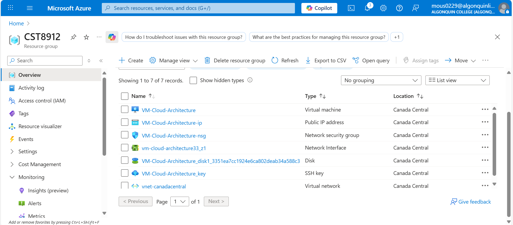

### VM Started
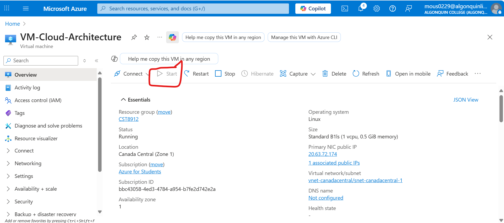

### VM Start, Restart, Stop
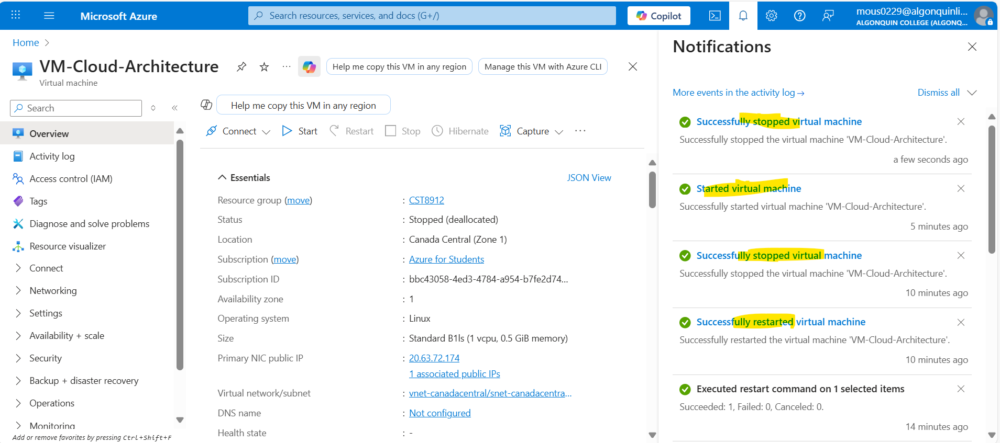

### Log Analytics Deployment
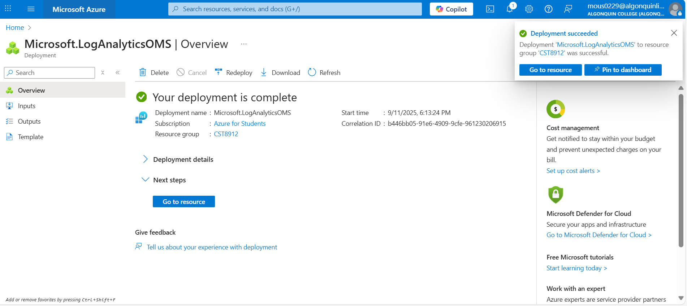

### Log Analytics
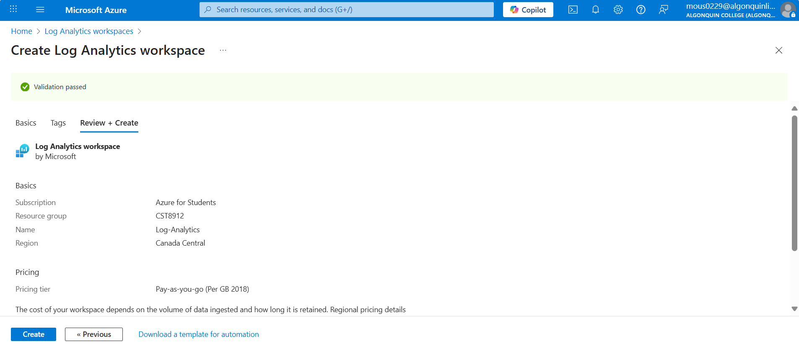

### Log Connected
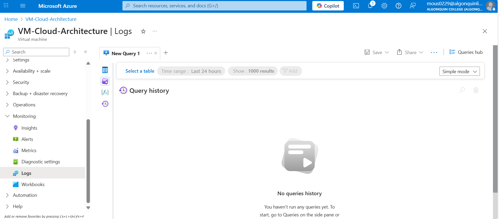

### Data Collection Rule
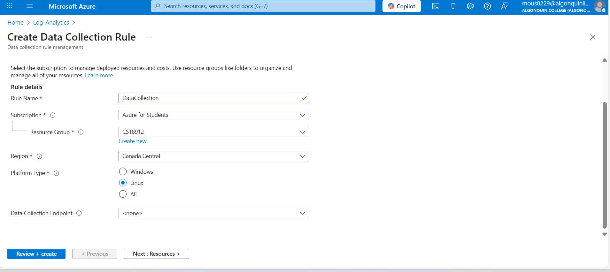

### Enable Insight Log
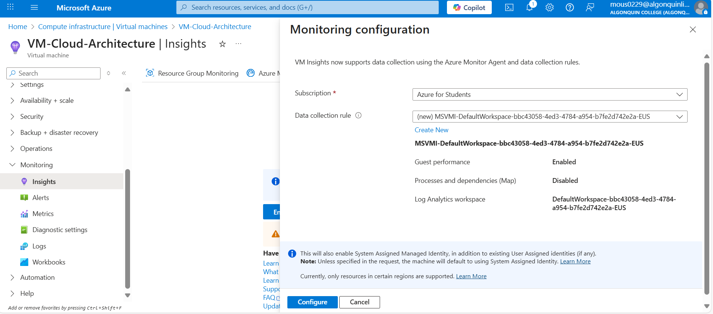

### SSH Task
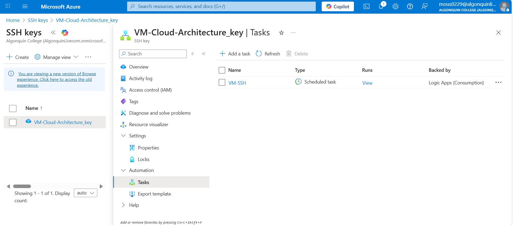

### Testing Commands
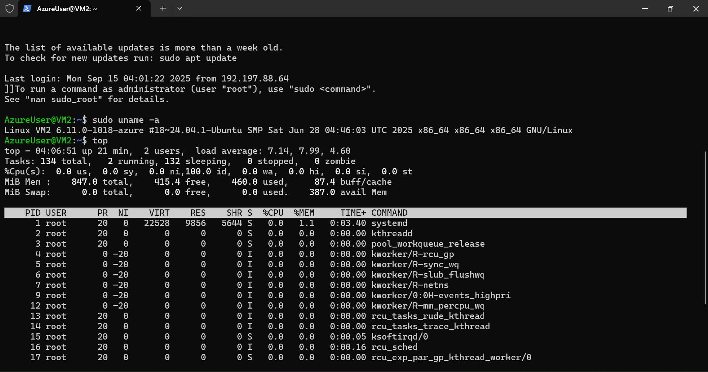

### Testing Commands 2
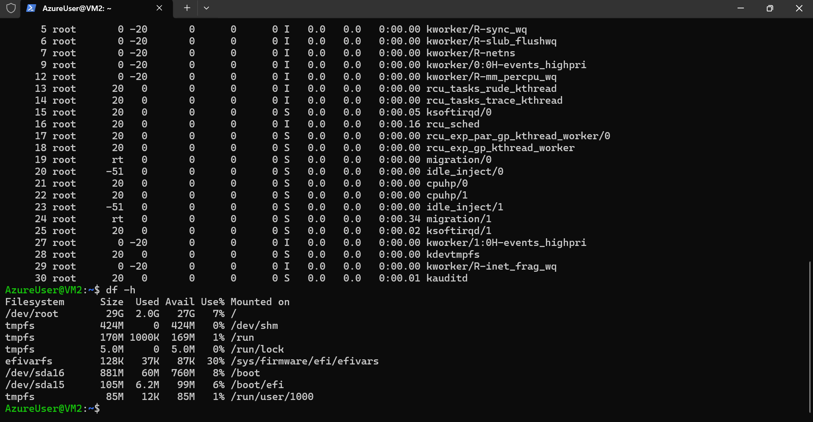