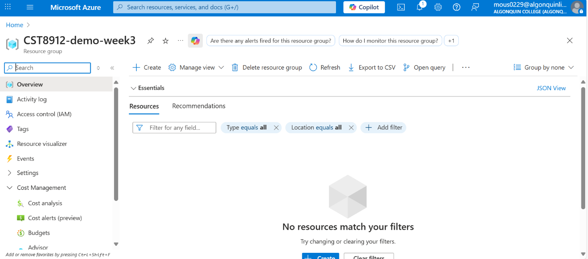
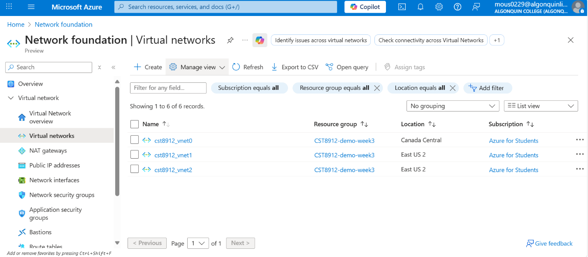
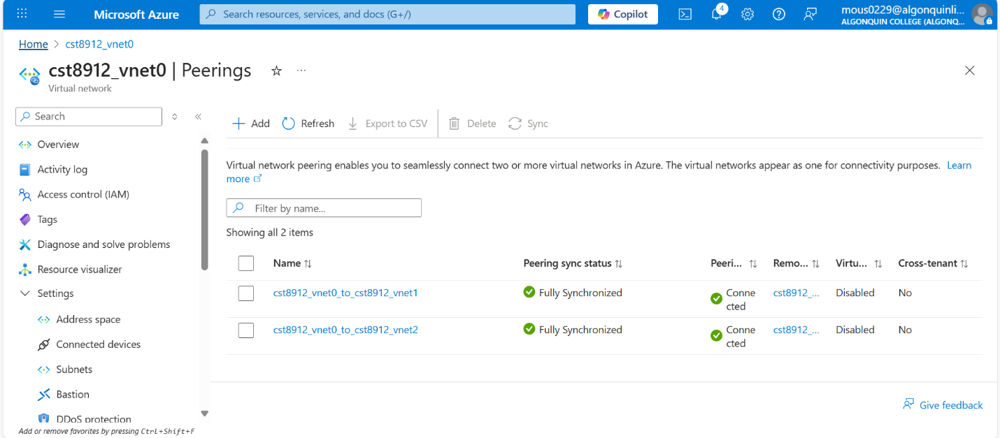
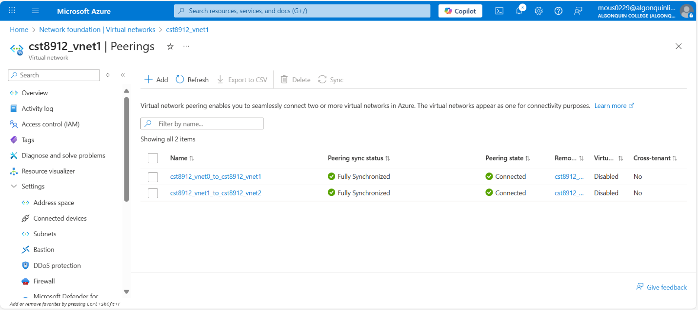
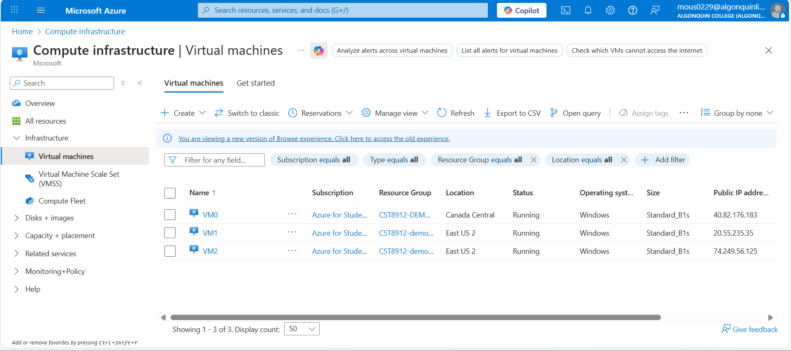
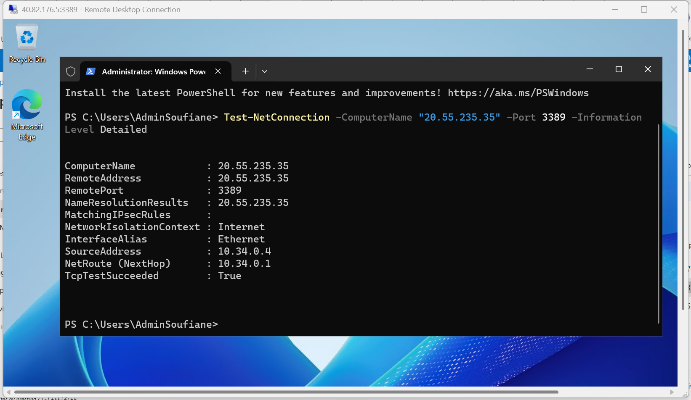
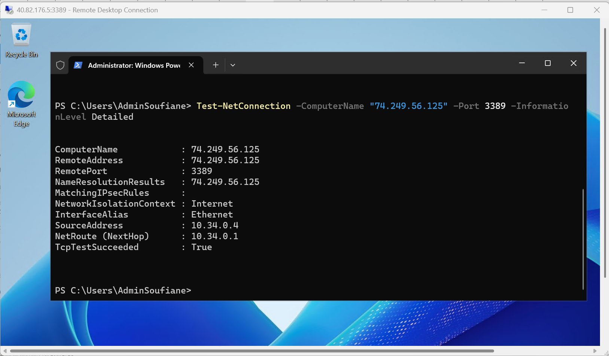
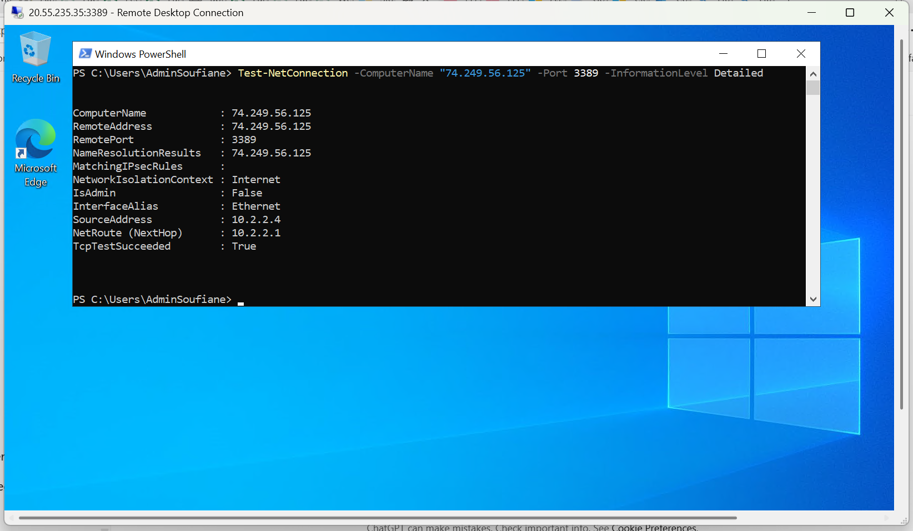

# ***Lab 2 -- Week 3***

## 25F_CST8912_011 Cloud Solutions Architecture

#### Resource Group creation

#### Virtual Networks

#### Peering configuration

**VNet0** Peering with **VNet1** and **VNet 2**

**VNet1** Peering with **VNet2**

#### VM deployments

#### PowerShell Test-Net Connection results

**VM0 To VM1**

**VM0 To VM2**

**VM1 To VM2**

#### Why VNet peering is important?

VNet peering is important and mandatory when we have different virtual
networks either locally or globally with VMs and want to make a
connection between to allow data

duplication from one region to the other. It also helps us with
performance, it allows us to have low latency and high bandwidth.

How private IP communication was established?

Private IP communication in Azure is established through VNet routing
system

when a VM is created, its network interface is assigned a private IP
from the subnet, and Azure automatically provides routes so that VMs
within the same VNet can talk to each other directly over the Azure
backbone without internet exposure.

if VMs are in different VNets or regions, communication is enabled
through VNet peering, and traffic flow can still be restricted or
allowed by NSGs or the VM's own firewall.

Benefits of global peering (performance & security)

Global VNet peering lets Azure VNets in different regions communicate
using private IPs over Azure instead of the public internet, which gives
us a better performance, low latency along with security.
