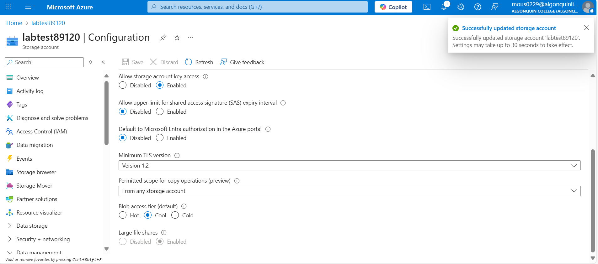

# Lab3 Week 4

### Storage Account Creation

### Redundancy Change

### Blop access tier

### Create container

### Upload Blop

### Access Tier to Hot

### Private Access not permitted

### Generate Shared Access Signature

### Private Access working – File downloaded 

### Create Lifecycle Management Rule

