# LAB 4 - Week 5

### Create SQL Database Server
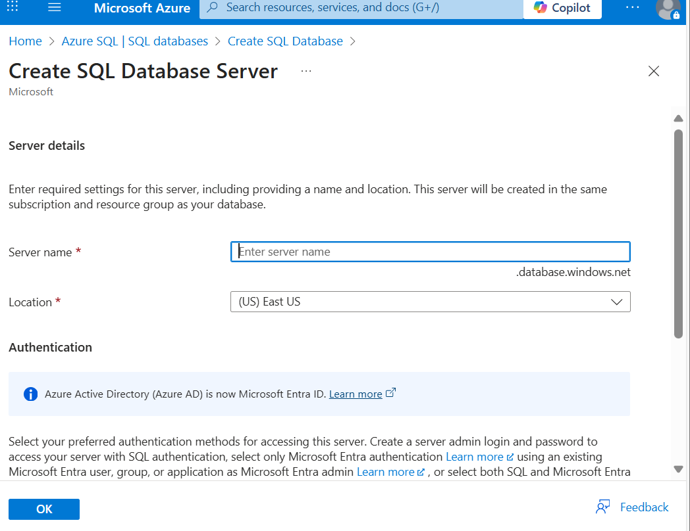

### SQL Database Deployment

### SQL Server SQL Database

### Query Editor
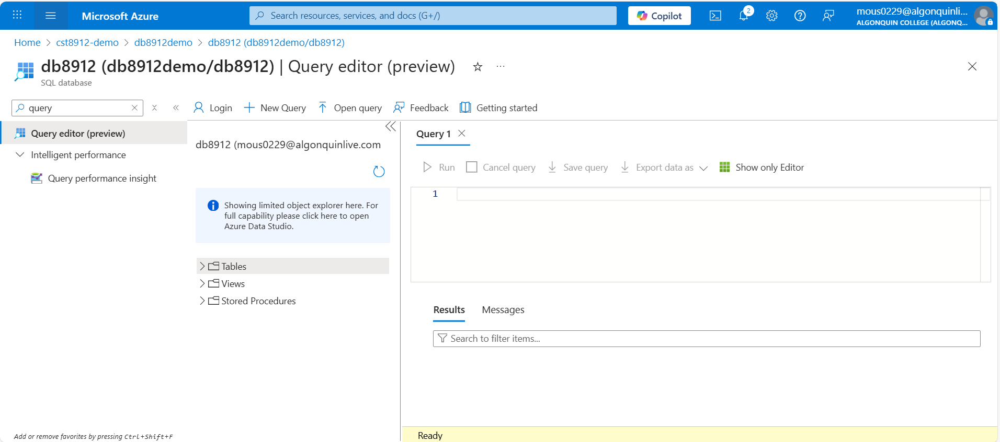

### Query One
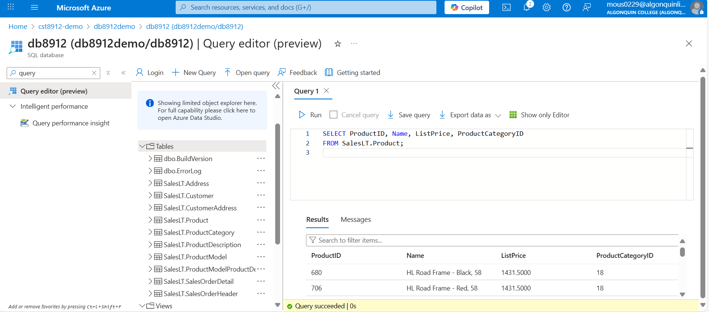

### Query Two
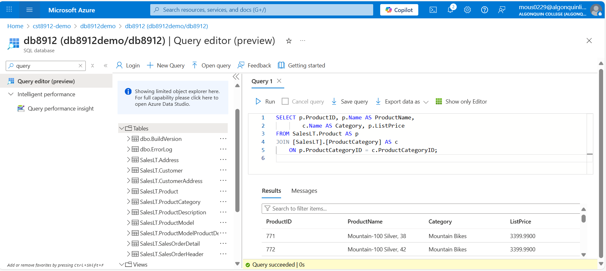

### Storage Account
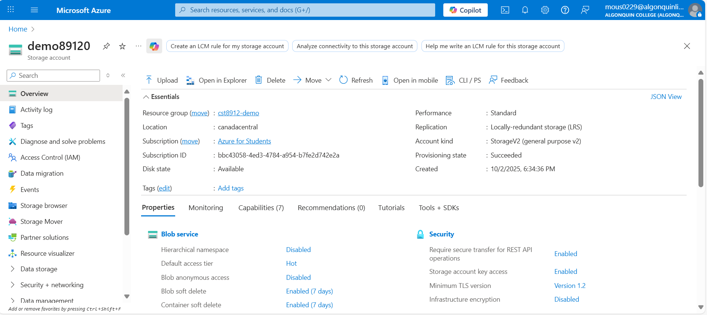

### Create Container
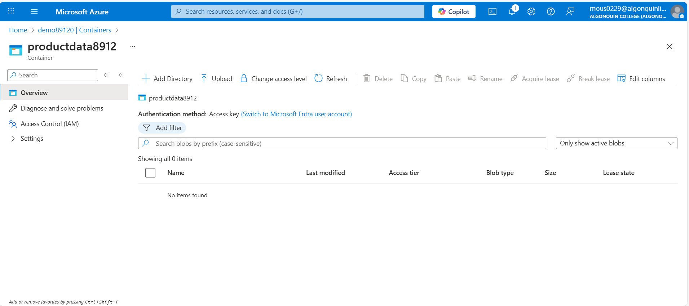

### Data Factory
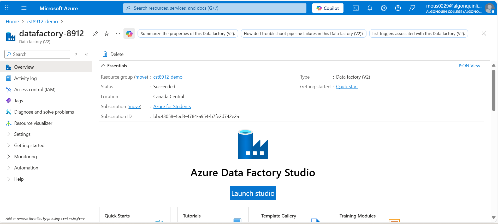

### Data Factory Studio
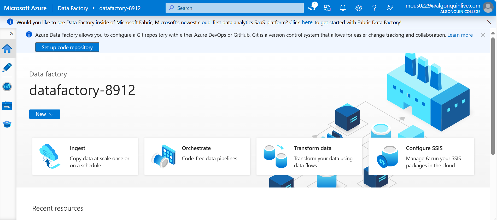

### SalesLS Product
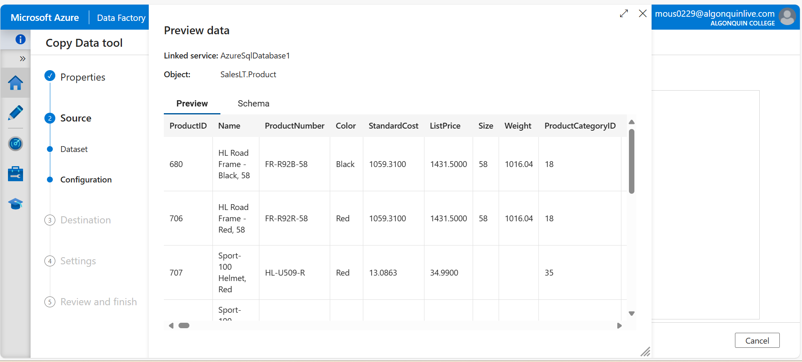

### Deployment Completed
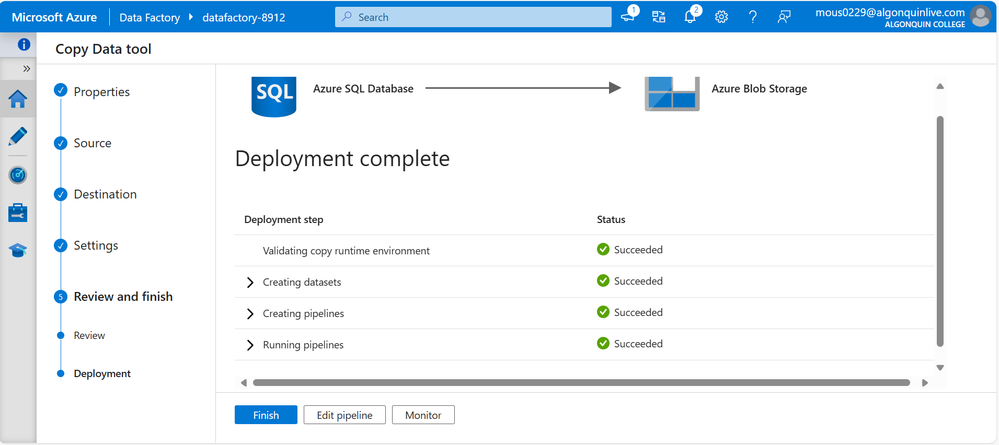

### Pipeline Succeded
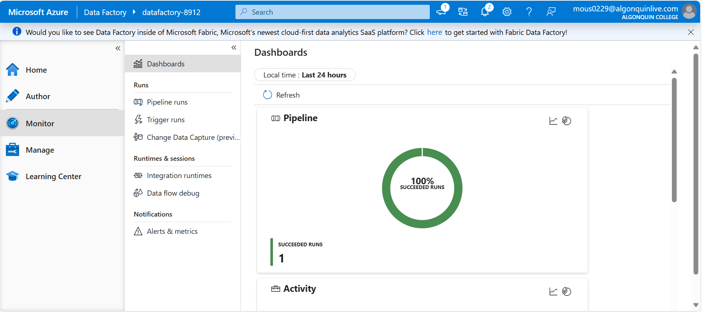