# Lab 6 - Week 6

### Creation of VNET
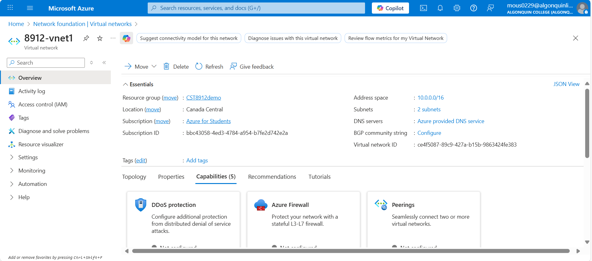

### VNet Deployment
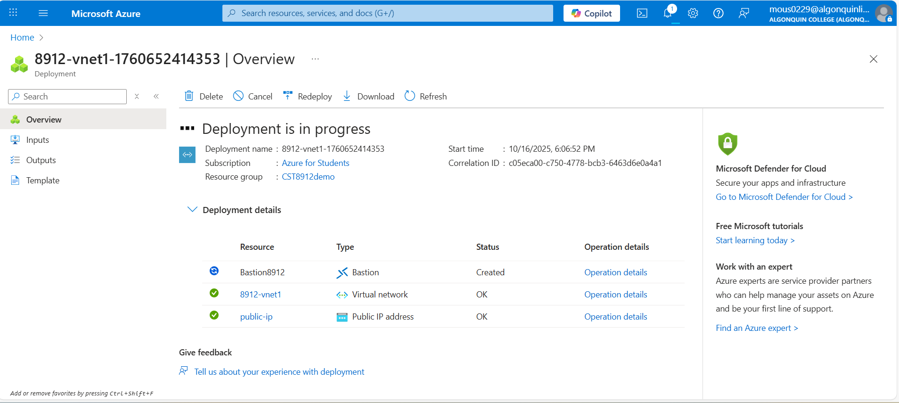

### Create Storage Account
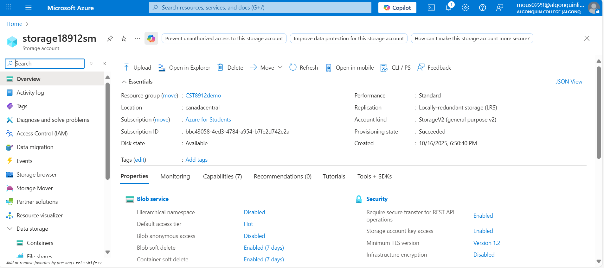

### Disable Public Network Access
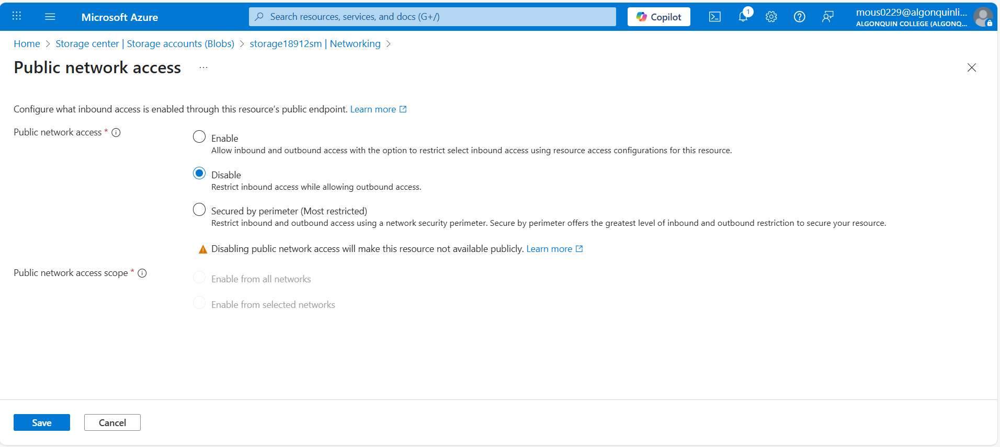

### Private End-Point Deployment
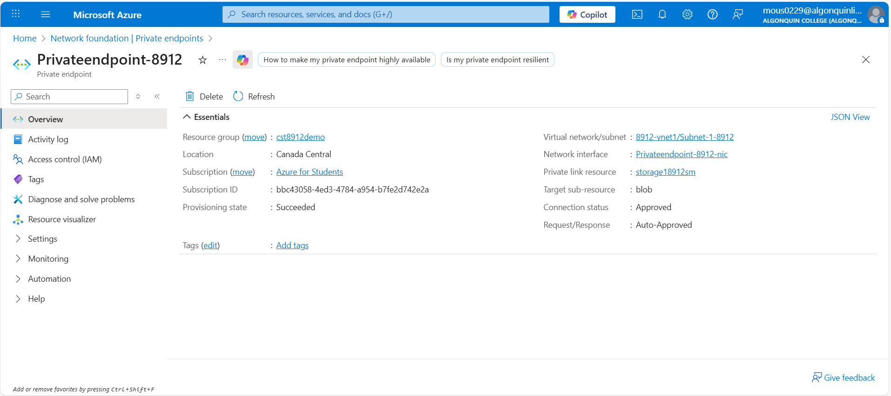

### VM Creation
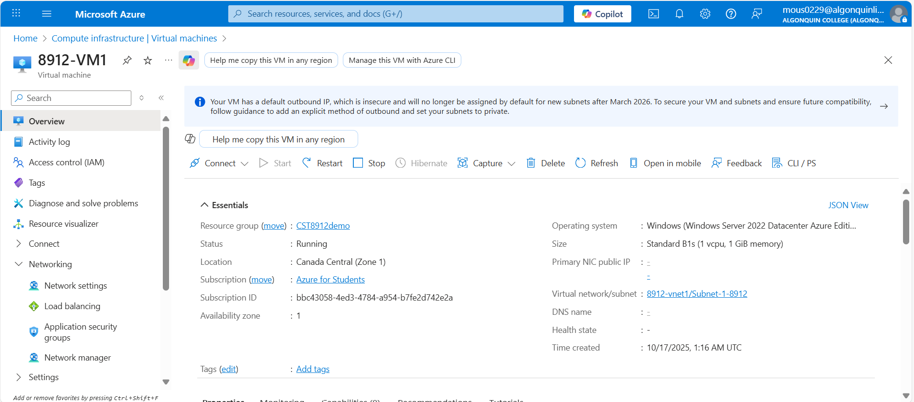

### Get Access Key
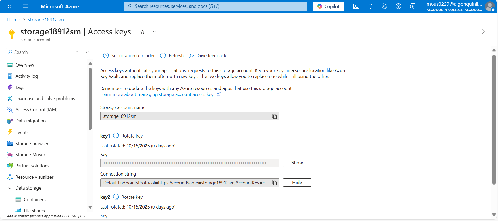

### Container Creation
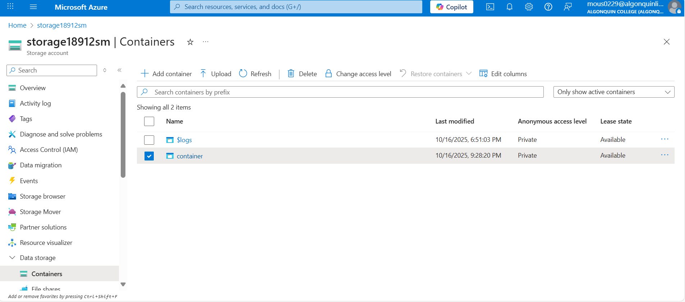

### Testing Connectivity
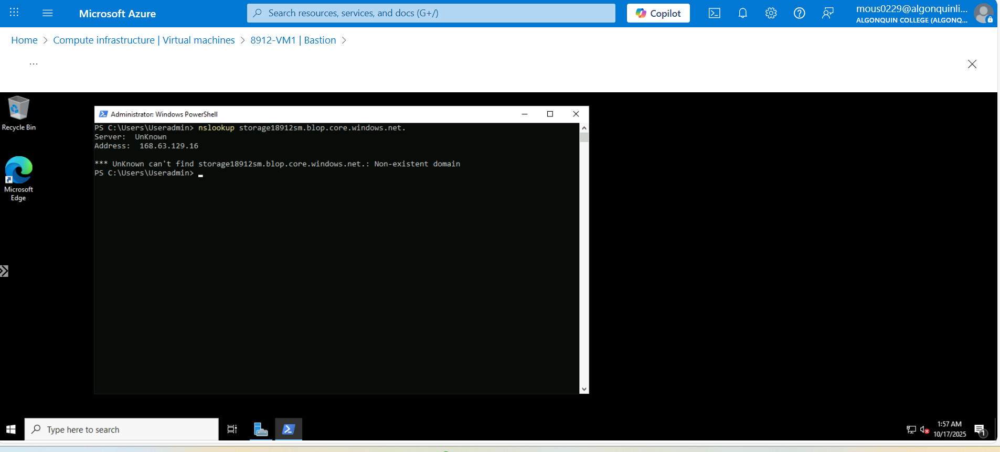

### Connect To Azure Storage
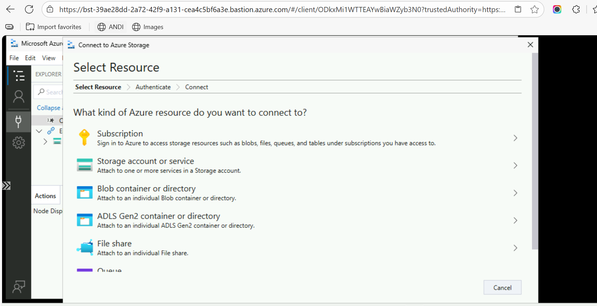

### Successful Connection to Azure Storage
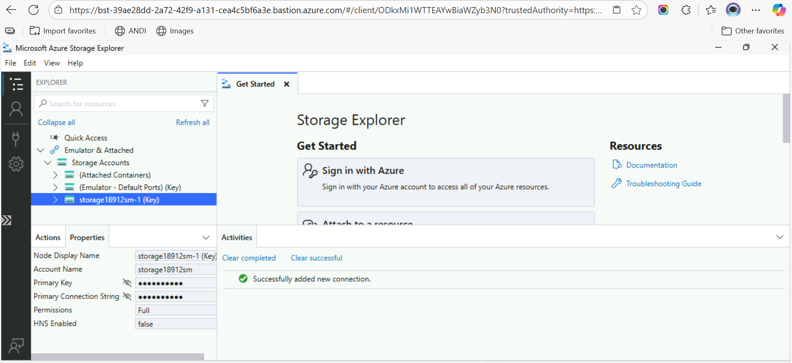

### Display Container
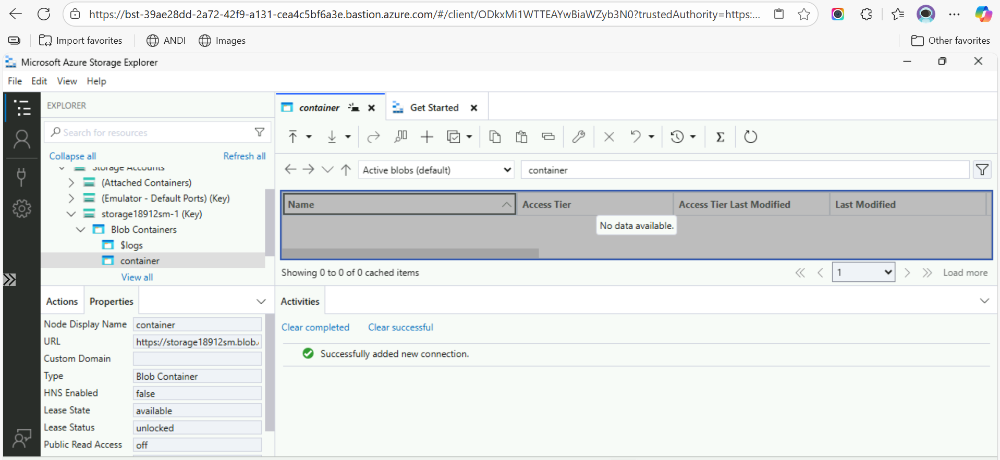
